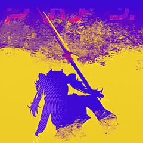
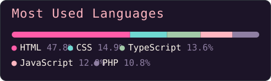

<!--
  ╔══════════════════════════════════════════════════════════════════╗
  ║  RETRO VHS GITHUB PROFILE                                        ║
  ║                                                                  ║
  ║  HOW TO USE:                                                     ║
  ║  1. Create a repo named EXACTLY like your username               ║
  ║                                                                  ║
  ║  2. Drop this file in as README.md.                              ║
  ║  3. Find-and-replace  andhikapp28  with your real handle.        ║
  ║  4. Swap the AVATAR / project / social links marked TODO.        ║
  ║                                                                  ║
  ║  Palette:  cream #fdf6ec · purple #2b1f3d/#3d2b4f · ink #1c1428  ║
  ║           pink #ffb6c1/#ff5ca8 · green #a3c9a8 · cyan #6fd8d1    ║
  ║  GitHub strips <style>/animations, so motion + fonts come from   ║
  ║  external SVG services (readme-typing-svg, capsule-render).      ║
  ╚══════════════════════════════════════════════════════════════════╝
-->

<!-- ══════════════════ HERO ══════════════════ -->

<!-- Waving VHS banner with the display name -->
<!-- Custom animated SVG (embedded fonts + resonance rings / equalizer / particles / shimmer). Edit assets/banner.svg to tweak. -->

<!-- ══ typing line (VT323 + pink) ══ -->

<!-- ══════════════════ > whoami ══════════════════ -->
## &gt; whoami

<!-- Photo = GitHub avatar (already 1:1). Swap src to ./assets/<file> for a custom photo. -->
<table align="center">
  <tr>
    <td width="230" valign="middle" align="center">
      
    </td>
    <td valign="middle">
<pre>
Nama   : Andhika Putra (Dipa)
Kampus : Institut Teknologi Sumatera (ITERA)
Lokasi : Indonesia
Role   : System Analyst · Technical Writer · QA · he/him
Now    : Wuthering Waves enjoyer + ngoding kalau lagi mood saja
</pre>
    </td>
  </tr>
</table>

 

<!-- ══════════════════ ◆ STATUS SCREEN ══════════════════ -->
## ◆ STATUS SCREEN

<!-- Row 1: coding stats + streak — reliable services, retro pink/cyan on ink -->

&nbsp;&nbsp;

  

<!-- Row 2: Most Used Languages — custom SVG, real byte-count data from public repos -->

  

<!-- Row 3: contribution "signal" — VHS waveform in the exact palette -->

 

<!-- ══════════════════ ◆ CARTRIDGE COLLECTION ══════════════════ -->
## ◆ CARTRIDGE COLLECTION

<!-- Chunky pastel chips cycling the design's 4-color chip palette -->
<!-- Row: languages I dabble in when the mood hits -->

<!-- Row: day-job tools — analysis, testing, writing -->

 

<!-- ══════════════════ ◆ RENTAL SHELF ══════════════════ -->
## ◆ RENTAL SHELF — FEATURED PROJECTS

<!--
  Real repos, sorted by last push. Titles link to the repo.
  When github-readme-stats is back up you can swap any card for a live pin:
  
-->

<table>
  <tr>
    <td width="50%" valign="top">
      <h3>🟣 <a href="https://github.com/andhikapp28/my-cf-katalog">my-cf-katalog</a> &nbsp;<kbd>★ NEW</kbd></h3>
      
Katalog buat Comic Frontiers — bantu nyari circle & artist incaran sebelum hunting di venue.

      

        
        
        
      

    </td>
    <td width="50%" valign="top">
      <h3>🌸 <a href="https://github.com/andhikapp28/mybini">mybini</a> &nbsp;<kbd>★ FUN</kbd></h3>
      
List my bini — daftar waifu pilihan. Murni buat senang-senang, jangan dihakimi.

      

        
        
        
      

    </td>
  </tr>
  <tr>
    <td width="50%" valign="top">
      <h3>💠 <a href="https://github.com/andhikapp28/loginformUI">loginformUI</a> &nbsp;<kbd>UI</kbd></h3>
      
Eksperimen tampilan form login — main-main sama styling, layout, dan micro-interaction.

      

        
        
        
      

    </td>
    <td width="50%" valign="top">
      <h3>🟢 <a href="https://github.com/andhikapp28/wuwek">wuwek</a> &nbsp;<kbd>WIP</kbd></h3>
      
Sandbox eksperimen JavaScript — tempat coba-coba ide random sambil ngoprek.

      

        
        
        
      

    </td>
  </tr>
</table>

 

<!-- ══════════════════ FOOTER ══════════════════ -->

<!-- Socials — swap the href links for your real handles (TODO) -->

 

◀◀ REWIND · TAPE END ▶▶ &nbsp;·&nbsp; profile views: 

